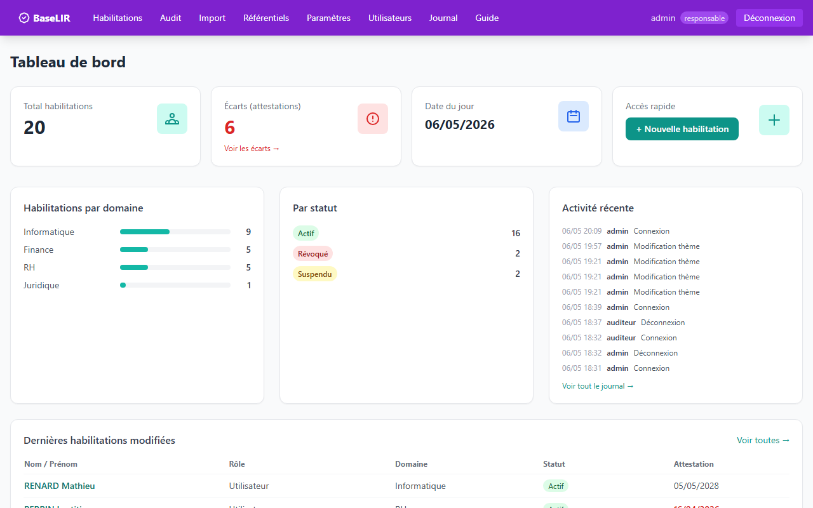
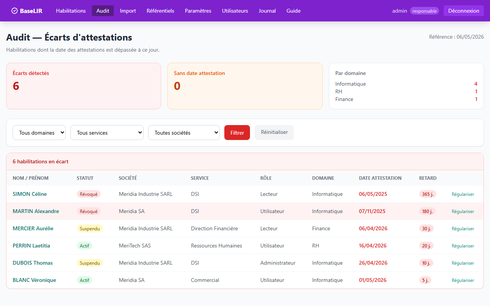
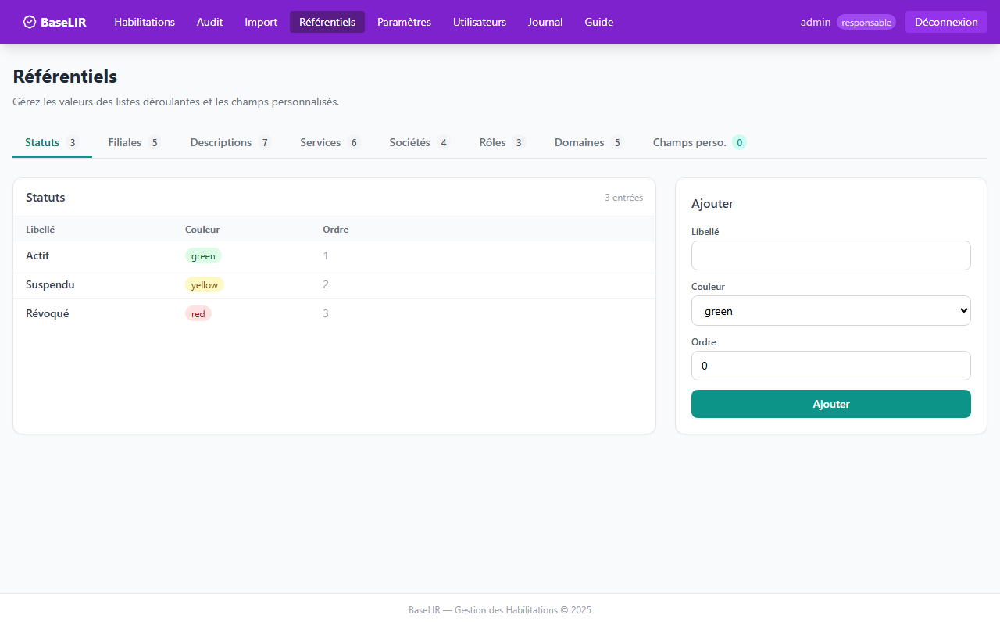
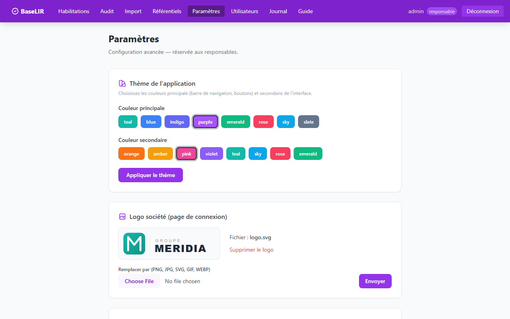

# BaseLIR — Base de Liaisons Individus-Rôles


Application web de gestion des habilitations au sein d'une organisation. Remplace un fichier Excel de suivi des personnes habilitées à intervenir sur un domaine avec un rôle spécifique.

---

## Aperçu

| Tableau de bord | Audit — Écarts d'attestations |
|---|---|
|  |  |

| Référentiels | Paramètres (thème + logo + SSO) |
|---|---|
|  |  |

---

## Fonctionnalités

| Fonctionnalité | Responsable | Auditeur |
|----------------|:-----------:|:--------:|
| Consulter les habilitations | ✓ | ✓ |
| Créer / modifier / supprimer | ✓ | — |
| Historique des modifications | ✓ | ✓ |
| Import CSV / Excel | ✓ | — |
| Page Audit (écarts attestations) | ✓ | ✓ |
| Référentiels personnalisables | ✓ | — |
| Champs personnalisés dynamiques | ✓ | — |
| Gestion des utilisateurs | ✓ | — |
| Logo société (page login) | ✓ | — |
| SSO Active Directory / LDAP | ✓ | — |
| Thème de couleur personnalisable | ✓ | — |
| Journal d'activité | ✓ | ✓ |

## Stack technique

| Composant | Technologie |
|-----------|-------------|
| Backend | FastAPI + Python 3.10+ |
| ORM | SQLAlchemy |
| Base de données | SQLite |
| Templates | Jinja2 |
| CSS | Tailwind CSS (CDN) |
| Sessions | itsdangerous |
| Mots de passe | bcrypt |
| Import | openpyxl (Excel), csv stdlib |
| SSO | ldap3 |

## Installation rapide

```bash
# Python
python -m venv venv && venv\Scripts\activate   # Windows
pip install -r requirements.txt
python run.py
```

```bash
# Docker
docker compose up --build -d
```

Ouvrir : **http://localhost:8001**

## Comptes par défaut

| Identifiant | Mot de passe | Rôle |
|-------------|-------------|------|
| admin | noukiebogosse2026 | Responsable |
| auditeur | noukiebogosse2026 | Auditeur |

> Changer ces mots de passe après la première connexion.

## Structure du projet

```
BaseLIR/
├── app/
│   ├── main.py              # App FastAPI, routes login/dashboard
│   ├── models.py            # 14 modèles SQLAlchemy
│   ├── database.py          # SQLite → data/baselir.db
│   ├── auth.py              # Auth locale + LDAP/AD
│   ├── utils.py             # Helpers (login, config, flash, pagination)
│   ├── theme_cache.py       # Cache module-level du thème de couleur
│   ├── templates_config.py
│   └── routers/
│       ├── habilitations.py # CRUD + champs dynamiques
│       ├── admin.py         # Référentiels fixes, champs perso, settings
│       ├── audit.py         # Écarts attestations
│       ├── users.py         # Gestion utilisateurs
│       ├── activity.py      # Journal
│       └── import_hab.py    # Import CSV/Excel
├── templates/
│   ├── admin/
│   │   ├── referentiels.html  # Onglet champs perso inclus
│   │   └── settings.html      # Thème, logo, LDAP
│   ├── habilitations/         # list, form, detail, history
│   ├── import/                # upload, result
│   └── ...
├── uploads/             # Logos (persisté via volume Docker)
├── data/                # Base SQLite (persisté via volume Docker)
├── Dockerfile
├── docker-compose.yml
└── requirements.txt
```

## Champs d'une habilitation

| Champ | Description |
|-------|-------------|
| Statut | État de l'habilitation (couleur personnalisable) |
| Nom et Prénom | Identité de la personne habilitée |
| Filiale du Groupe | Filiale de rattachement |
| Description | Nature de la mission |
| Service | Service ou département |
| Société | Entité juridique |
| Rôle | Rôle accordé |
| Domaine | Périmètre fonctionnel |
| Date d'octroi | Date d'attribution |
| Date des attestations | Date limite — génère un écart si dépassée |
| Champs perso. | Champs supplémentaires créés par l'admin |

## Champs personnalisés dynamiques

Sans modifier la base de données, un responsable peut créer de nouveaux champs (ex: Région, Pays, Niveau…) dans **Référentiels > Champs perso.** Ces champs apparaissent automatiquement dans tous les formulaires d'habilitation.

## Import CSV / Excel

Format d'en-tête (ordre libre, noms approchés acceptés) :

```
Nom et Prénom,Statut,Filiale du Groupe,Description,Service,Société,Rôle,Domaine,Date d'octroi,Date des attestations
```

- Les valeurs de référentiels inexistantes sont créées automatiquement
- Téléchargez le modèle via `/import/template`

## SSO Active Directory

Configurer dans **Paramètres > Active Directory** :
- Serveur LDAP, port, domaine (ex: `societe.local`), base DN
- TLS optionnel (port 636)
- Restriction par **OU** : seuls les utilisateurs dont le DN contient le chemin OU configuré peuvent se connecter
- Restriction par **groupe AD** : seuls les membres du groupe configuré peuvent se connecter
- Les utilisateurs AD inconnus sont créés avec le rôle Auditeur

## Thème de couleur

Configurer dans **Paramètres > Thème** :
- **Couleur principale** : barre de navigation et boutons (teal, blue, indigo, purple, emerald, rose, sky, slate)
- **Couleur secondaire** : accents (orange, amber, pink, violet…)
- Le thème est persisté en base et s'applique à toute l'interface sans redémarrage

## Données de démonstration

Deux scripts utilitaires sont fournis à la racine du projet.

### Charger les données fictives

```bash
python seed_demo.py
```

Injecte 20 habilitations réalistes pour la société fictive **Groupe Meridia** :
- 5 filiales, 4 entités juridiques, 6 services, 5 domaines
- Statuts variés : 13 Actif · 2 Suspendu · 2 Révoqué
- 6 attestations expirées (pour illustrer la page Audit)

> Les données ne sont **jamais** commitées — `data/` est dans `.gitignore`.

### Remettre la base à zéro

```bash
python reset_db.py
```

Supprime toutes les habilitations, référentiels et configuration, puis recrée
les comptes et données par défaut (admin, auditeur, 3 statuts, 3 domaines, 3 rôles).

## Sécurité en production

Remplacer la clé de session dans `app/main.py` :
```bash
python -c "import secrets; print(secrets.token_hex(32))"
```

## Licence

MIT License — Copyright (c) 2026 nashvilleboy2019-art
